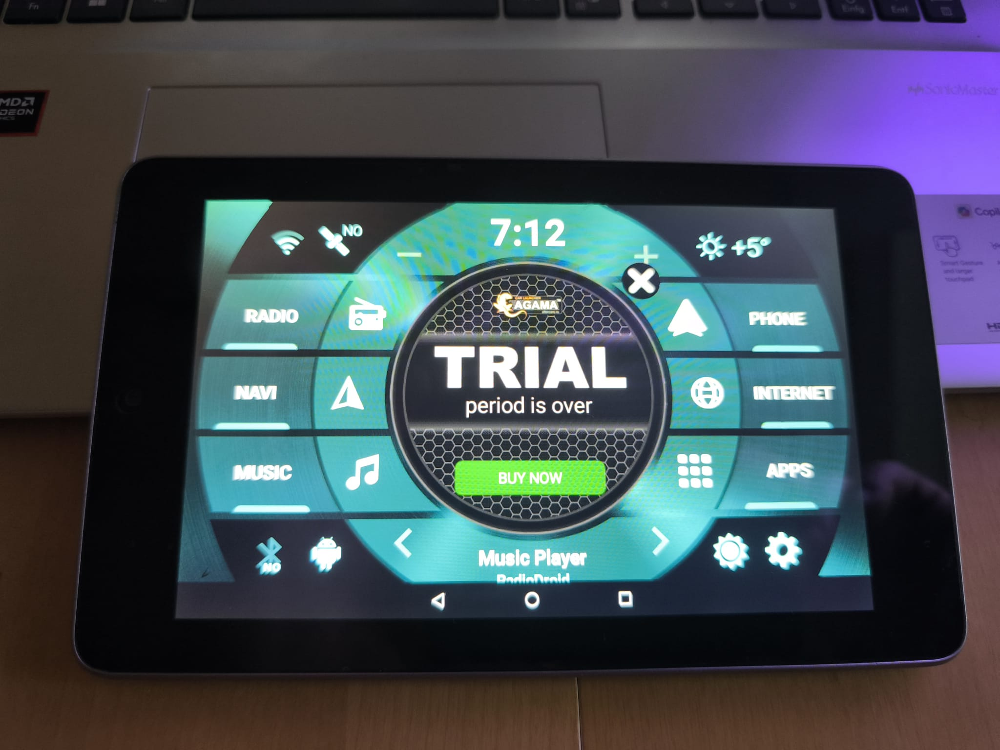
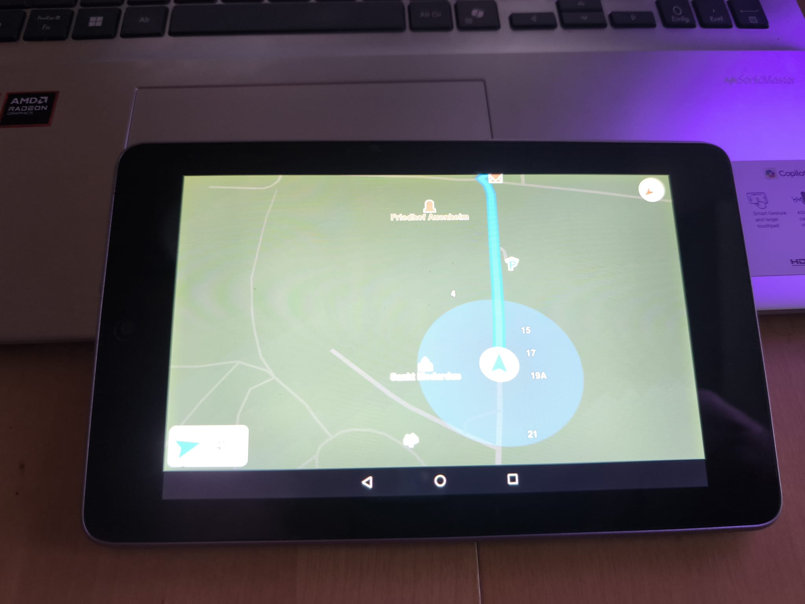
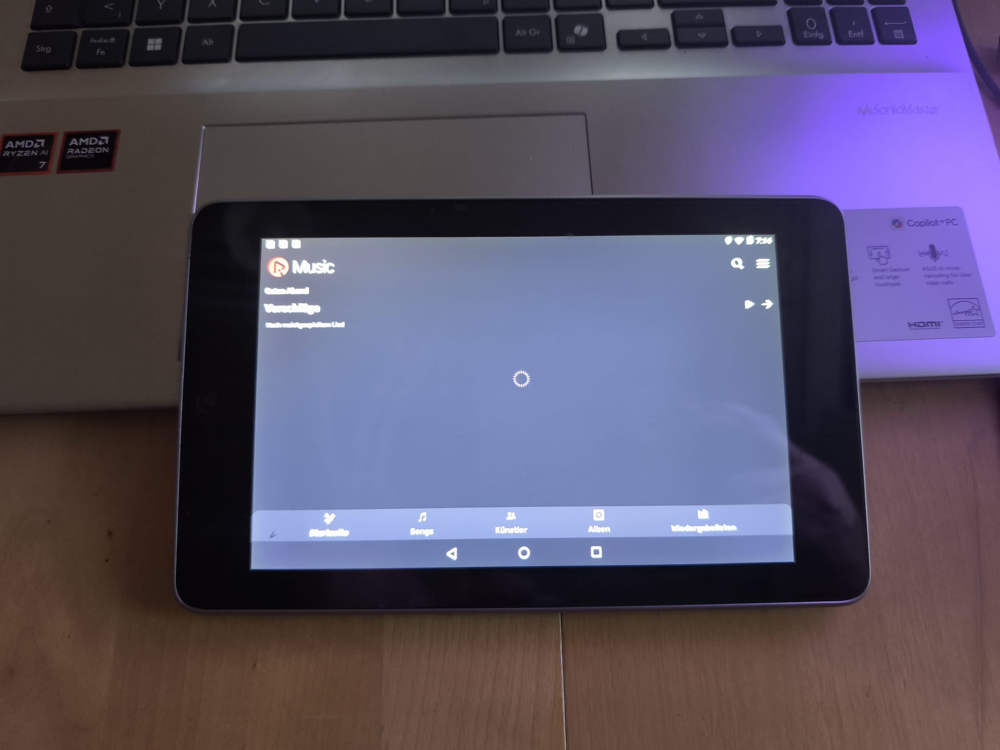
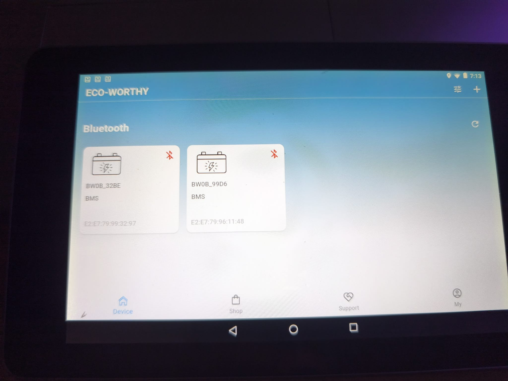

# Nexus 7 → Digital Dashboard for a 1986 Fiat Ducato

Turning a 2012 Google Nexus 7 into the central touchscreen of a 1986 Fiat Ducato camper: offline navigation, live battery monitoring over Bluetooth, and media control — all on hardware that shipped with Android 4.1 and was long past vendor support.

*[Deutsche Fassung](README.de.md) · [Flashing walkthrough](docs/flashing.md)*



---

## Why

The Ducato is from 1986. There is no head unit, no CAN bus to tap, no factory display — just a dashboard with a hole in it. Buying a modern double-DIN Android unit would have worked, but I had a Nexus 7 (2012) sitting in a drawer, and a 7" 1280×800 IPS panel is a better screen than most budget head units ship with.

The catch: stock Android 4.1 on a Tegra 3 was slow when the device was new, and by now it is unusable — no security updates, no current apps, and the notorious eMMC slowdown that made these tablets crawl after a few years of use.

So the project was less "install an app" and more: get a supportable OS onto obsolete hardware, then make it behave like an appliance rather than a tablet.

## What it does

- **Offline navigation** — full map data on device, so routing keeps working with no mobile signal (relevant in a camper, less so in a city).
- **Live battery monitoring** — the camper's two leisure batteries have Bluetooth BMS modules. The tablet pairs with both and reads out the battery state, so the electrical system is visible from the driver's seat instead of from a hatch in the floor.
- **Media** — internet radio and local music, controlled from a touch UI sized for a moving vehicle.
- **Appliance behaviour** — powers on by itself when the ignition supplies power, sleeps when it is cut. No power button, no lock screen, no "where did the launcher go".

Each function runs on its own channel: **GPS** for positioning, **Bluetooth** for the battery modules, and Wi-Fi or a phone hotspot only for internet radio and updates. Nothing that matters while driving depends on having a connection.

## Hardware & software

| | |
| :--- | :--- |
| Device | Google Nexus 7 (2012) Wi-Fi — codename `grouper`, Tegra 3 |
| Vehicle | Fiat Ducato, 1986 |
| ROM | AOSP Android 7.1.2 (Nougat), AndDiSa build for `grouper` |
| Recovery | TWRP 3.x (`grouper`) |
| Google apps | OpenGApps `arm / 7.1 / pico` |
| Launcher | Agama Car Launcher |
| Battery monitoring | ECO-WORTHY BMS (2×) over Bluetooth LE |
| Automation | Tasker / MacroDroid |

## The decisions that mattered

### Android 7.1.2 instead of something newer

Community ROMs for `grouper` exist up to considerably newer Android versions, and the instinct is to take the highest number available. On this device that is the wrong call. The Tegra 3 has four Cortex-A9 cores and 1 GB of RAM, and the real bottleneck is the eMMC — later Android versions with bigger runtimes and more background work spend their time waiting on storage.

I went with AndDiSa's AOSP 7.1.2 build because it is maintained specifically for this device and tuned around those constraints. Paired with the `pico` GApps package rather than a full one — every Google service that is installed is a background process competing for the same slow storage.

The result is a tablet that opens the map instantly. A newer Android on the same hardware would have looked better on a spec sheet and been worse to use at a junction.

### Power on with the ignition

A dashboard that needs a button press is not a dashboard. The Nexus 7 bootloader has an off-mode-charge flag that controls what happens when power is applied to a powered-off device — by default it shows a charging animation and stays off. Disabling it makes the device boot instead:

```bash
fastboot oem off-mode-charge 0
```

With the tablet wired to a switched circuit, turning the key boots it.

### Sleep management

The counterpart to booting on power is not staying awake forever afterwards. *Developer options → Stay awake while charging* keeps the screen alive during a drive, and Tasker rules handle the transitions: power connected → screen on, Bluetooth on, launcher to the front; power disconnected → screen off and deep sleep, so the device does not drain the starter battery overnight.

## Screenshots

| | |
| :--- | :--- |
|  |  |
| Offline navigation — map data on device, no connection needed | Media playback |



*Both BMS modules paired in the ECO-WORTHY app. Shown disconnected here — these photos were taken at a desk, away from the vehicle.*

## Honest limitations

- **The launcher is a trial.** Agama Car Launcher is paid software and the trial has expired on this install, which is why the screenshot has a "buy now" overlay across it. Either license it or move to an open alternative.
- **Micro-USB as the power connector** is the weak point of the whole build — it is not a connector designed for permanent vibration. A worn port is the most likely thing to fail first.
- **These photos are bench shots**, not installation shots. They show the running system, not the finished dashboard mount.

## Flashing walkthrough

The full step-by-step — bootloader unlock, TWRP, wipe, sideload — is in **[docs/flashing.md](docs/flashing.md)**.

> ⚠️ Unlocking the bootloader erases the device completely. Anything on internal storage is gone.

---

*Built in my own camper. Documentation written up afterwards, from notes and from the device itself.*
